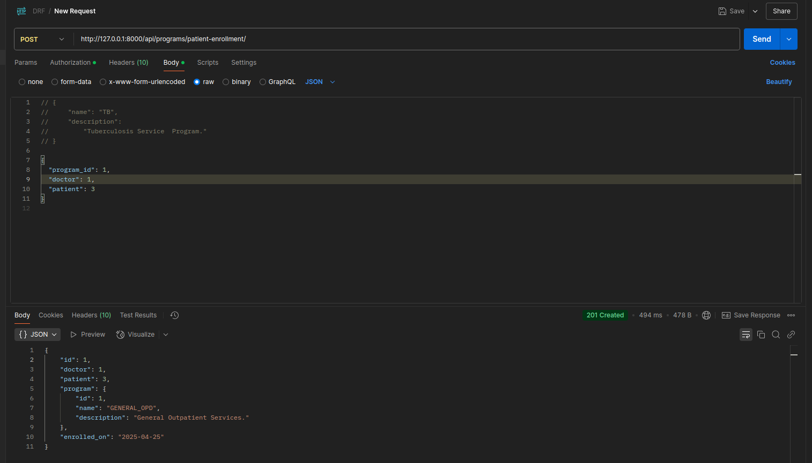

# Tiba-Programs

## 🛠️  Setup Guidelines

### 1. Clone the Repository
```bash
git clone https://github.com/Kimani-Dominic/Tiba-Programs.git
cd Tiba-Programs
cd Health_Programs
```

### 2. Create & Activate Virtual Environment
```bash
python3 -m venv venv
source venv/bin/activate
```

### 3. Install Requirements
```bash
pip install -r requirements.txt
```

### 4. Database setup
- Ensure PostgreSQL is installed and running on your system.

```bash
psql -U postgres
```

- Create a new database and user and grant the user privileges
Replace `<your_username>` and `<your_password>`

```sql
CREATE DATABASE programs_db;
CREATE USER <your_username> WITH PASSWORD '<your_password>';
ALTER ROLE <your_username> SET client_encoding TO 'utf8';
ALTER ROLE <your_username> SET default_transaction_isolation TO 'read committed';
ALTER ROLE <your_username> SET timezone TO 'UTC';
GRANT ALL PRIVILEGES ON DATABASE programs_db TO <your_username>;
```

- Exit psql:

```bash
\q
```

### 5. Set Up `.env` File
Create a `.env` file and configure:
Setup 
```env
DATABASE_NAME=programs_db
DATABASE_USER= <your_username> 
DATABASE_PASSWORD= <your_password>
DATABASE_HOST=localhost
DATABASE_PORT=5432
```

### 6. Apply Migrations 
If they have issues, you can run each app migrations separately 
eg.
```python manage.py makemigrations Auth ```

```bash
python manage.py makemigrations
python manage.py migrate
```

### 7. Create Superuser
```bash
python manage.py createsuperuser
```
### 8. Run Server
```bash
python manage.py runserver
```

### 9. Access Admin & Docs
- Admin: `http://127.0.0.1:8000/admin/`
- Swagger Docs: `http://127.0.0.1:8000/swagger/`
- ReDoc: `http://127.0.0.1:8000/redoc/`

---

## API Documentation

The API endpoints are structured as follows:

### Authentication

#### `POST /api/register/`  
Registers a new user.  
**Payload:** `username`, `email`, `password` , `role`

```json
{
  "username": "doctor123",
  "email": "doctor123@mailinator.com",
  "password": "SecureP@ssw0rd!",
  "confirm_password": "SecureP@ssw0rd!",
  "role": "doctor"
}
```
**Response:** User successfully created with status 201 

#### `POST /api/user-search/?username`
Querying one specific user

---

### Programs
create a new program
**Payload:** `program name`, `a brieff description`

```json
{
  "name": "TB",
  "description": "Tuberculosis program"
}
```

### 📄 API Docs UI

- `GET /swagger/` – Swagger UI interactive documentation  
- `GET /redoc/` – ReDoc alternative documentation interface  

---

## Postman collections from the prototype
Enable basic Auth and enter the basic Auth credentials since the Api endpoints are protected and will be throwing a `403 Unathorized` if not authenticated before making any API calls.

### Samples
#### User Registration
Register  User - `http://127.0.0.1:8000/api/doctor123/`


`http://127.0.0.1:8000/api/user-search/`

Or insert specific user with their first/ username
`http://127.0.0.1:8000/api/user-search/?query=username`

#### Programs

1. program creation


2. enrolling a patient to a program



3. Get patient's enrolled to, programs


4. Appointments for patients


5. Patient Records

