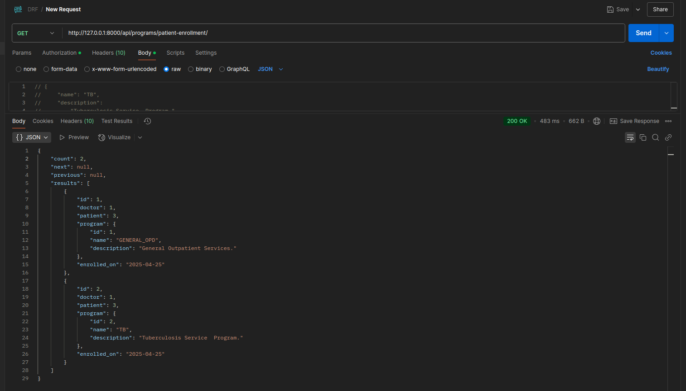

# Tiba-Programs

## 🛠️  Setup Guidelines

### 1. Clone the Repository
```bash
git clone https://github.com/Kimani-Dominic/Tiba-Programs.git
cd Tiba-Programs
cd Health_Programs
```

### 2. Create & Activate Virtual Environment
```bash
python3 -m venv venv
source venv/bin/activate
```

### 3. Install Requirements
```bash
pip install -r requirements.txt
```

### 4. Database setup
- Ensure PostgreSQL is installed and running on your system.

```bash
psql -U postgres
```

- Create a new database and user and grant the user privileges
Replace `<your_username>` and `<your_password>`

```sql
CREATE DATABASE programs_db;
CREATE USER <your_username> WITH PASSWORD '<your_password>';
ALTER ROLE <your_username> SET client_encoding TO 'utf8';
ALTER ROLE <your_username> SET default_transaction_isolation TO 'read committed';
ALTER ROLE <your_username> SET timezone TO 'UTC';
GRANT ALL PRIVILEGES ON DATABASE programs_db TO <your_username>;
```

- Exit psql:

```bash
\q
```

### 5. Set Up `.env` File
Create a `.env` file and configure:
Setup 
```env
DATABASE_NAME=programs_db
DATABASE_USER= <your_username> 
DATABASE_PASSWORD= <your_password>
DATABASE_HOST=localhost
DATABASE_PORT=5432
```

### 6. Apply Migrations 
If they have issues, you can run each app migrations separately 
eg.
```python manage.py makemigrations Auth ```

```bash
python manage.py makemigrations
python manage.py migrate
```

### 7. Create Superuser
```bash
python manage.py createsuperuser
```
### 8. Run Server
```bash
python manage.py runserver
```

### 9. Access Admin & Docs
- Admin: `http://127.0.0.1:8000/admin/`
- Swagger Docs: `http://127.0.0.1:8000/swagger/`
- ReDoc: `http://127.0.0.1:8000/redoc/`

---
<!-- 
## API Documentation

The API endpoints are structured as follows:

### Authentication

#### `POST /api/register/`  
Registers a new user.  
**Payload:** `username`, `email`, `password` , `role`

```json
{
  "username": "newuser123",
  "email": "user@email.com",
  "password": "SecureP@ssw0rd!",
  "confirm_password": "SecureP@ssw0rd!",
  "role": "patient"
}
```
**Response:** User successfully created with status 201 

#### `POST /api/login/`  
Authenticates a user.  
**Payload:** `username`, `password`  

```json
{
  "username": "newuser123",
  "password": "SecureP@ssw0rd!",
}
```
**Response:** Auth token
---

### 📅 Appointments

#### `POST /api/appointments/`  
Creates a new appointment.  
**Payload:**  `date`, `time`.  
```json
{
  "appointment_time": "2025-04-15T10:30:00Z"
}

```
Only users with user role patients can create appointments
**Auth required:** ✅ 


#### `GET /api/appointments/`  
Retrieves a list of appointments for the logged-in user and doctors who is scheduled for the appointment.  
**Auth required:** ✅

#### `PUT /api/appointments/<int:pk>/update/`  
Updates the status of a specific appointment i.e approved, cancelled, completed.  
**Auth required:** ✅


### 📁 Medical Records

#### `POST /api/records/create/`  
Creates a new medical record entry for a patient.  
**Payload:**  `diagnosis`, `treatment`, `notes`  
```json
{
  "diagnosis": "Malaria",
  "treatment": "Prescribed antibiotics and rest",
  "notes": "Patient advised to follow up in one week"
}

```
**Auth required:** ✅

#### `GET /api/records/`  
Lists all medical records associated with the logged-in user i.e patient.  
**Auth required:** ✅


### 📄 API Docs UI

- `GET /swagger/` – Swagger UI interactive documentation  
- `GET /redoc/` – ReDoc alternative documentation interface  

---

## Postman collections
Enable basic Auth and enter the basic Auth credentials since the Api endpoints are protected and will be throwing a `403 Unathorized` if not authenticated before making any API calls.

### Samples
Register  User - `http://127.0.0.1:8000/api/register/`

- patient


curl post


- doctor


- appointment



- medicalrecords
 -->